## Forth on FPGA for AI &amp; Robotics
* temp storage before transition to the team project (https://github.com/angelus9/AI-Robotics/)
* work in progress (inner, comma, pusher)

## Is it time for another Forth Chip?
* [this conversation](https://groups.google.com/g/comp.lang.forth/c/6adve-Z1ppU) sort of seal the fate of this project.

## Outer Interpreter block diagram
> 

## Implementation Details
* Mem pool and Find
  |mem pool (single port RAM)|find (dictionary search)|
  |---|---|
  |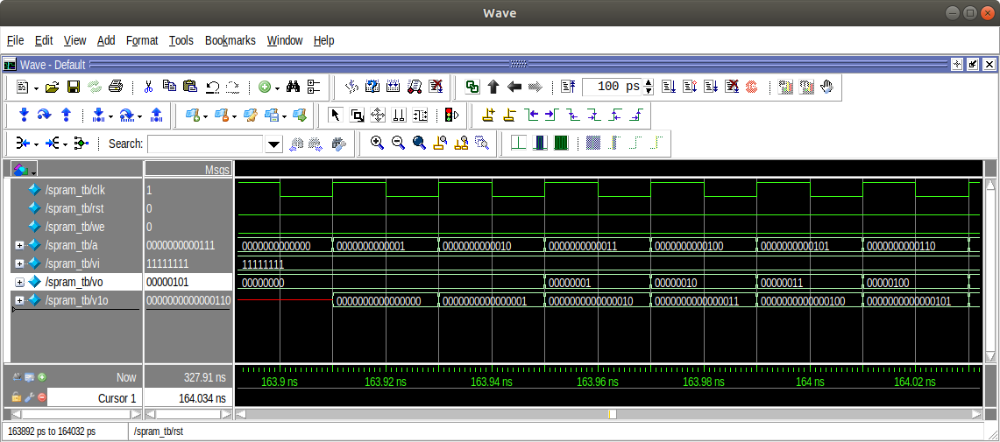|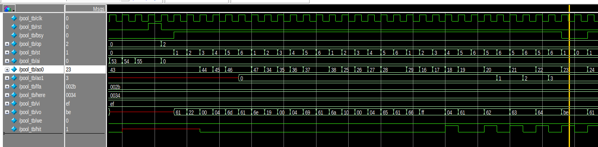|
* Atoi (string to integer)
  |   |case0|case1|
  |---|---|---|
  |   |8-state, dedicated comparator|3-state, synthesizer gen comparators|
  |LUT|220 LUTS|182 LUTS|
  |src|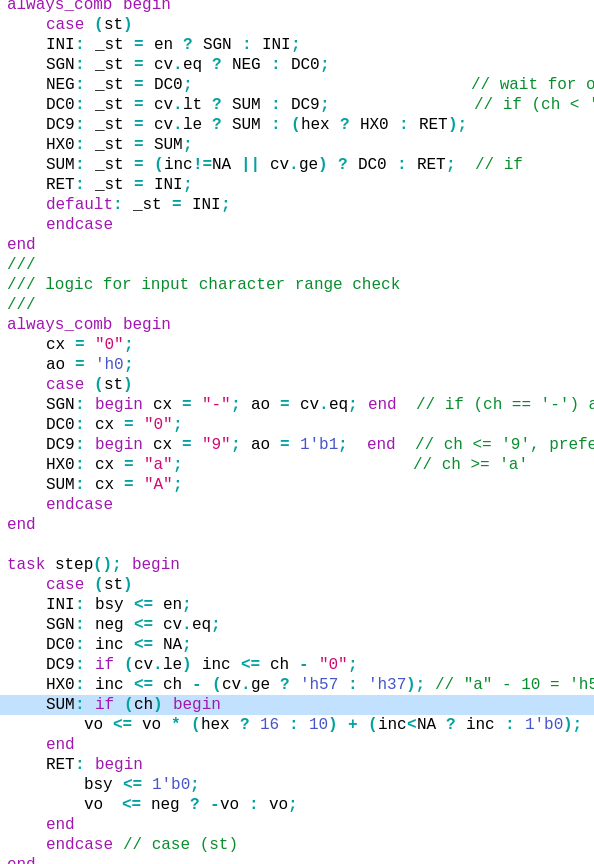|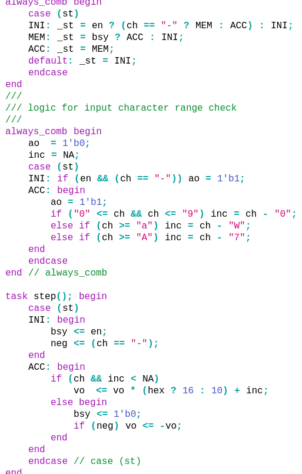|
  |syn|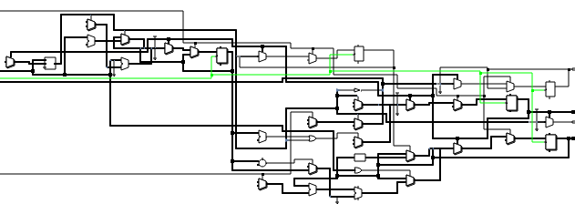|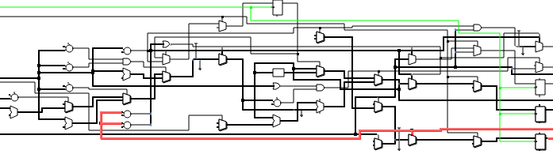|
  |sim||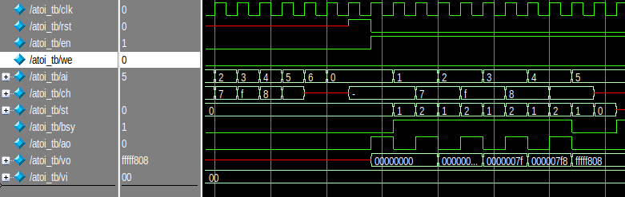|
* Module transition (outer interpreter)
  |fnd->a2i-psh|fnd->exe->fnd|
  |---|---|
  |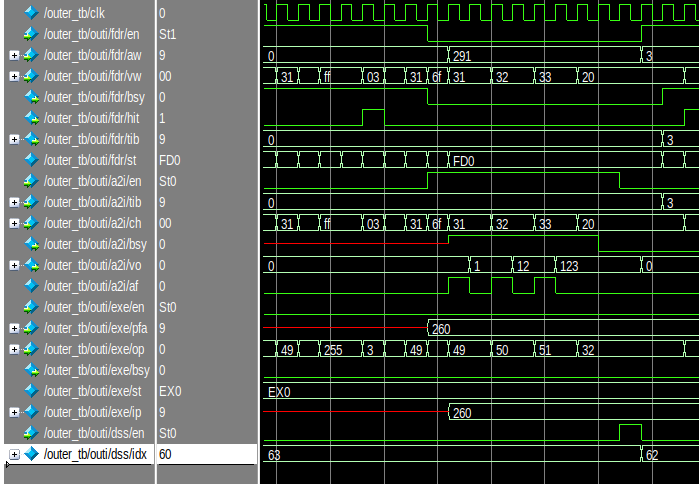|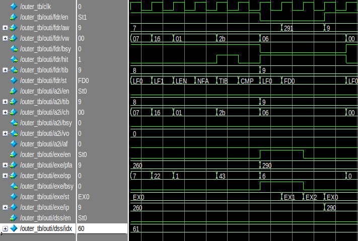|
* Execution unit
  |stack op|ALU op|
  |---|---|
  |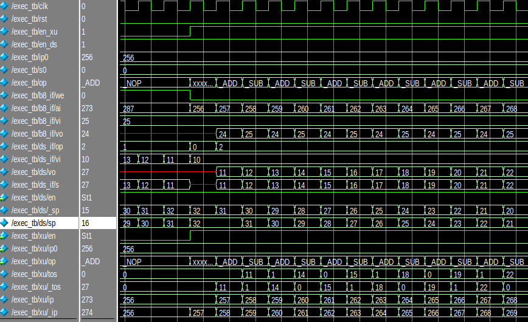|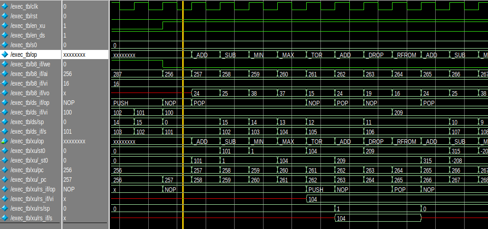|
* Inner interpreter
  |123 dup +|234 -|
  |---|---|
  |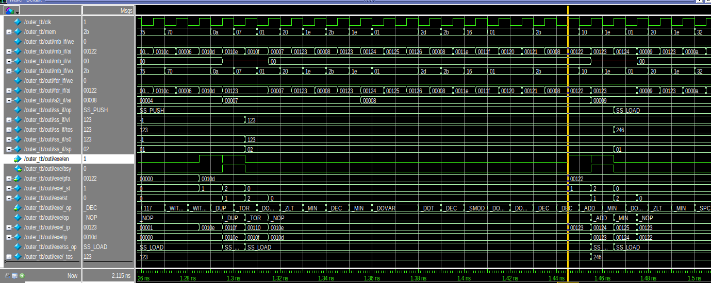|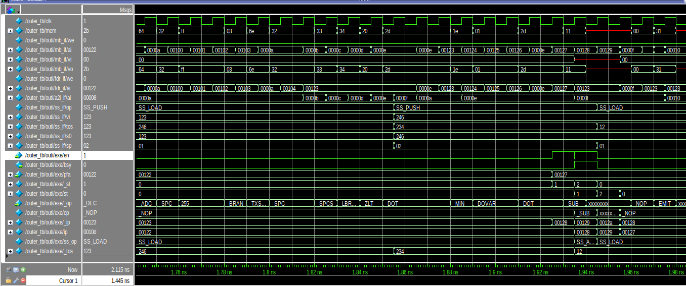|

