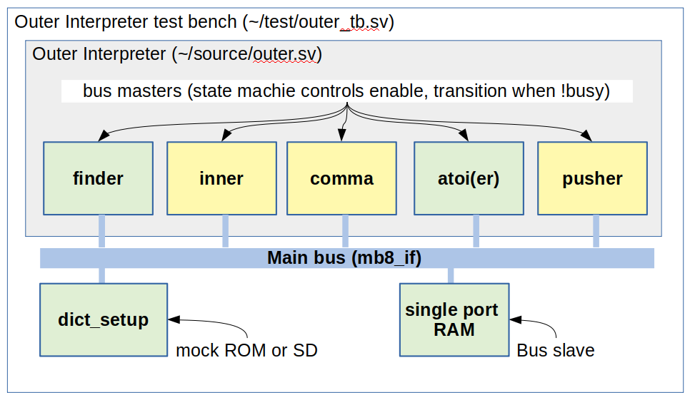

## Forth on FPGA for AI &amp; Robotics
* temp storage before transition to the team project (https://github.com/angelus9/AI-Robotics/)
* work in progress (inner, comma, pusher)

### Outer Interpreter block diagram

### mem pool (single port RAM)

### find (dictionary search)

### atoi (string to integer)
|   |case0|case1|
|---|---|---|
|   |8-state, dedicated comparator|3-state, synthesizer gen comparators|
|LUT|220 LUTS|182 LUTS|
|src|||
|syn|||
|sim|||

### module transition (outer interpreter)
|case|simulation|
|---|---|
|fnd->a2i->psh||
|fnd->exe->fnd||

### execution unit
|case|simulation|
|---|---|
|stack op||
|alu op||

### inner interpreter
|case|simulation|
|---|---|
|123 dup||
|456 sub||

