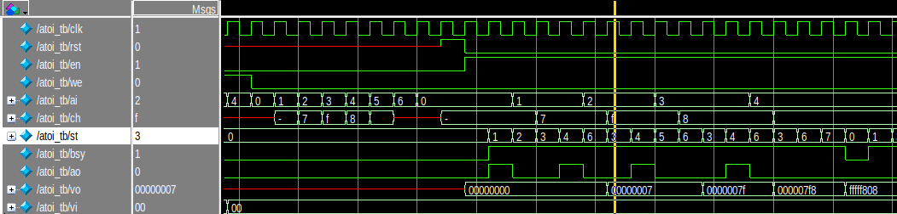

# forthsuper
## Forth on FPGA for AI &amp; Robotics
* temp storage before the team project is created
* work in progress

### mem pool

### find

### atoi
|   |case0|case1|
|---|---|---|
|src|||
|syn|||
|sim|||

